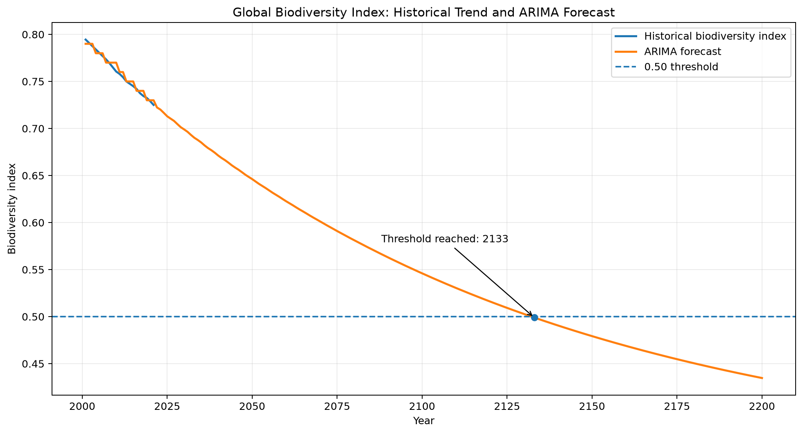

# Biodiversity Forecasting with ARIMA

A time-series analysis project exploring global biodiversity trends and forecasting when the biodiversity index could reach a critical level of **0.50**.

## Forecast at a Glance



The forecast pipeline now generates **80% and 95% prediction intervals** in addition to the point forecast, so the long-horizon projection is presented with explicit uncertainty rather than as a single deterministic path.

## Project Goal

Biodiversity is influenced by a complex combination of environmental pressures and human activity. This project combines biodiversity data with broader environmental indicators to explore long-term trends and build a forecast using an **ARIMA time-series model**.

The central analytical question is:

> Based on the historical trend, when could the global biodiversity index reach 0.50?

## Key Results

The original project analysis estimated that the modeled global biodiversity index could reach approximately **0.50 around 2132–2133** if the historical dynamics represented by the model continued.

The upgraded analysis no longer relies only on a single train/test split. Candidate ARIMA models are evaluated with **expanding-window rolling-origin validation**, using one-step-ahead forecasts. The selected ARIMA model is also compared against a **naive last-observation baseline** using both RMSE and MAE.

The exact validation metrics, selected ARIMA order, estimated point-forecast threshold-crossing year and milestone forecasts are generated by the analysis and saved to:

`results/model_results.csv`

This keeps reported model-performance figures reproducible rather than manually copied into the README.

These are long-horizon statistical projections, not deterministic predictions. Prediction intervals widen with forecast horizon, and policy interventions, measurement changes, structural environmental shifts and unforeseen events could materially change the trajectory.

## Validation Strategy

The model-selection workflow uses an expanding training window:

1. begin with approximately the first 66% of the historical world series;
2. fit an ARIMA model to all observations available at that point;
3. predict the next observation;
4. add the observed value to the training history;
5. repeat until the end of the historical series;
6. calculate RMSE and MAE across all one-step-ahead predictions.

For the same validation points, a naive baseline predicts that the next biodiversity-index value will equal the most recent observed value. Comparing ARIMA against this simple baseline provides a more meaningful test of whether the additional model complexity improves predictive performance.

## Forecast Uncertainty

The final ARIMA fit uses `statsmodels` forecast distributions to generate:

- point forecasts through 2200;
- **80% prediction intervals**;
- **95% prediction intervals**.

These intervals are stored alongside the point forecast in `data/ARIMA_forecast_world.xlsx` and displayed on the generated forecast chart.

The year when the **point forecast** first reaches 0.50 is highlighted separately from the uncertainty bands. This distinction is important: the threshold-crossing year should not be interpreted as a precise event date.

## Visual Analysis

The project includes an interactive Tableau dashboard that brings together the biodiversity analysis and broader environmental context:

[View the interactive Tableau dashboard](https://public.tableau.com/app/profile/giacomo.rossini/viz/PROJECT2_17025013200780/FINAL_dashboard?publish=yes)

The generated forecast data is available in `data/ARIMA_forecast_world.xlsx`, while `data/bounded_predictions_2100.xlsx` contains the country-level 2100 estimates.

## Portable Analysis

`analysis.py` is the recommended entry point for running the full forecasting workflow. It uses repository-relative paths, performs model selection and rolling validation, regenerates forecast outputs, produces prediction intervals, writes the validation summary and creates the static forecast chart.

Install the dependencies:

```bash
pip install -r requirements.txt
```

Then run:

```bash
python analysis.py
```

The main outputs are:

```text
assets/biodiversity-arima-forecast.png
results/model_results.csv
data/ARIMA_forecast_world.xlsx
data/bounded_predictions_2100.xlsx
```

For a fast chart-only refresh from an existing forecast file, `generate_chart.py` remains available.

The historical Jupyter notebook, `prev_biodivers.ipynb`, is kept as the original exploratory analysis and presentation of the work.

## Forecasting Approach

The upgraded project:

1. cleans and aggregates historical biodiversity data;
2. creates a global biodiversity time series;
3. evaluates candidate ARIMA `(p, d, q)` configurations with rolling-origin validation;
4. reports RMSE and MAE for both ARIMA and a naive baseline;
5. fits the selected ARIMA model to the full historical series;
6. generates point forecasts plus 80% and 95% prediction intervals through 2200;
7. estimates when the point forecast first reaches the 0.50 threshold;
8. compares the global time-series forecast with country-level linear-regression estimates for 2100.

## Data

Project datasets are stored in `data/`. Key files include:

| File | Purpose |
| --- | --- |
| `data/aggregate_exstintion_measure.xlsx` | Main biodiversity index input |
| `data/ARIMA_forecast_world.xlsx` | Generated global ARIMA forecast and prediction intervals |
| `data/bounded_predictions_2100.xlsx` | Country-level linear-regression forecast |
| `data/LAND_USED.xlsx` | Land and forest-use analysis |
| `data/annual_temp_and-co2-emissions-per-country.xlsx` | Temperature and CO2 data |
| `data/global-living-planet-index.xlsx` | Wildlife population trend data |
| `data/eart_consumption_country.xlsx` | Resource-consumption indicator |

The historical notebook also references `red-list-index.xlsx`. That source file is **not currently included in the repository**, so the related optional merge step is not part of the portable `analysis.py` workflow.

## Data Sources

The analysis uses environmental and biodiversity datasets from sources including:

- Our World in Data
- GBIF
- European biodiversity data sources

## Skills Demonstrated

- ARIMA time-series forecasting
- rolling-origin / walk-forward validation
- baseline model comparison
- RMSE and MAE model evaluation
- prediction intervals and uncertainty communication
- model selection
- data cleaning and aggregation
- environmental-data analysis
- reproducible analysis outputs
- data visualization with Tableau and matplotlib

## Limitations

The model extrapolates historical statistical patterns far beyond the observed data, so uncertainty becomes substantial at long horizons. Prediction intervals quantify model-based uncertainty but cannot account for structural breaks, future policy decisions, ecosystem regime changes or revisions to the biodiversity indicator itself.

A future extension could compare ARIMA against additional forecasting families, evaluate interval calibration, and document exact dataset versions and provenance in a dedicated data dictionary.
